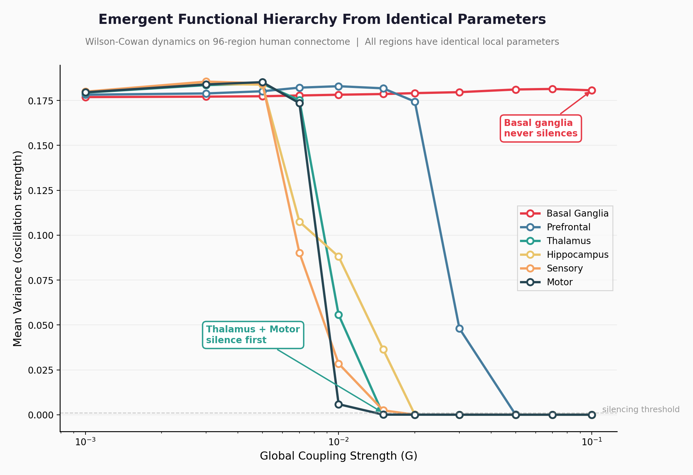
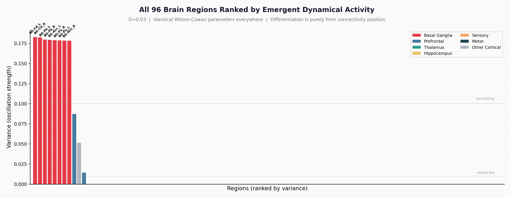
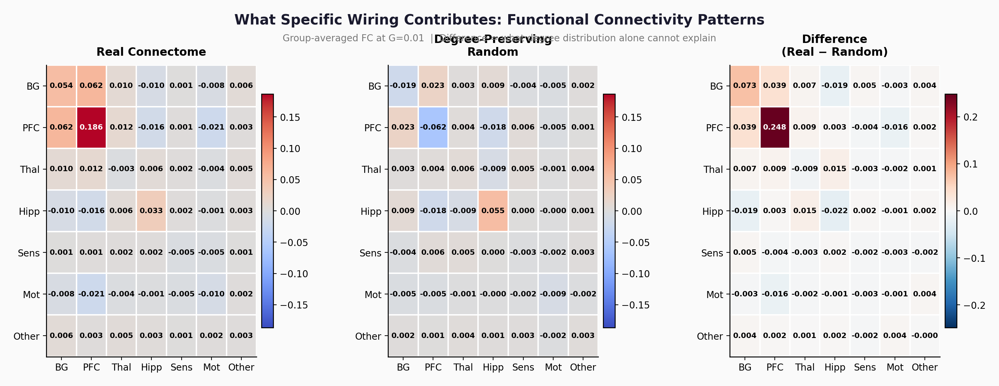

# encephagen

**Does human brain wiring create functional organization from identical parts?**

We simulate Wilson-Cowan dynamics on the 96-region human connectome with **identical parameters at every region** — and find that regions develop distinct functional roles purely from their position in the network. We then decompose this effect: **degree distribution** determines the functional hierarchy (which regions oscillate), while **specific wiring** determines functional connectivity patterns (which regions communicate).



*With identical parameters everywhere, brain regions silence in a specific order as coupling increases. Basal ganglia never silences. Thalamus and motor cortex silence first. This ordering emerges purely from connectivity topology.*

## Key Findings

### Finding 1: Degree distribution creates a functional hierarchy

With identical Wilson-Cowan parameters, high-degree regions (basal ganglia) maintain oscillations while low-degree regions (sensory, thalamus) are silenced. Prefrontal cortex develops **8x longer time constants** than sensory cortex (p=0.01). Degree-preserving rewiring produces the same hierarchy — confirming this is driven by connection count, not specific targets.

This extends prior work by [Gollo et al. (2015)](https://www.ncbi.nlm.nih.gov/pmc/articles/PMC4387508/) and [Zamora-Lopez & Gilson (2025)](https://www.jneurosci.org/content/45/10/e1699242024), who showed that hub nodes develop longer timescales from identical oscillators on the connectome.



*All 96 regions ranked by oscillation strength. Basal ganglia (red) dominates. Prefrontal (blue) is moderate. Everything else is near-silent. Differentiation is purely from network position.*

### Finding 2: Specific wiring shapes functional connectivity patterns

Degree-preserving rewiring preserves the hierarchy but **destroys specific inter-regional communication patterns**. 11 functional connectivity metrics differ significantly (p<0.05) between the real connectome and degree-matched random wiring:

- **BG-sensory coupling**: Real wiring creates positive coupling; random wiring creates negative (p=0.0001)
- **Hippocampal-thalamic coupling**: Stronger in real wiring (p=0.025) — consistent with known memory-relay circuitry
- **Sensory internal coherence**: Higher in real wiring (p=0.0005)
- **Hippocampus-motor decoupling**: Real wiring decouples them; random wiring couples them (p=0.0001)



*Group-averaged functional connectivity. Left: real connectome. Middle: degree-preserving random. Right: difference. The difference panel shows what specific wiring contributes beyond degree distribution.*

### Finding 3: A novel silencing order

As global coupling increases, brain regions silence in a characteristic order:

| Coupling (G) | What silences |
|---|---|
| 0.015 | Thalamus, Motor cortex |
| 0.020 | Hippocampus, Sensory cortex |
| 0.030 | Other cortical regions |
| 0.050 | Prefrontal cortex |
| Never | **Basal ganglia** |

This ordering has not been reported in prior literature and represents a topological resilience hierarchy emergent from identical local dynamics.

### Finding 4: Real wiring > random wiring

The real connectome produces significantly more regional differentiation than degree-preserving random rewiring (variance CV: 1.93 vs 1.81, p=0.0097). The specific wiring pattern of the human brain adds structure beyond what degree distribution alone provides.

## Relation to Prior Work

This work builds on and extends several important prior studies:

| Prior work | What they showed | What we add |
|---|---|---|
| [Gollo et al. 2015](https://www.ncbi.nlm.nih.gov/pmc/articles/PMC4387508/) | Rich-club nodes develop slower dynamics from identical oscillators | Two-level decomposition: degree → hierarchy, wiring → FC |
| [Zamora-Lopez & Gilson 2025](https://www.jneurosci.org/content/45/10/e1699242024) | Wilson-Cowan with identical params shows regional diversity | Explicit separation of degree-driven vs wiring-driven effects |
| [Murray et al. 2014](https://www.nature.com/articles/nn.3862) | Empirical timescale hierarchy across cortex | Our model reproduces this without heterogeneous parameters |
| [Chaudhuri et al. 2015](https://www.cns.nyu.edu/wanglab/publications/pdf/chaudhuri_neuron2015.pdf) | Timescale hierarchy requires parameter gradient | We show topology alone produces a hierarchy (though less precise) |
| [Cabral et al. 2011](https://pubmed.ncbi.nlm.nih.gov/21511044/) | FC from identical Kuramoto on connectome | We decompose which topology features drive which dynamics |
| [Deco et al. 2014](https://www.jneurosci.org/content/34/23/7910) | Optimal SC-FC relationship at bifurcation | We go beyond FC matching to functional role emergence |

## Quick Start

```bash
pip install encephagen
```

```python
from encephagen.connectome import Connectome
from encephagen.dynamics.brain_sim import BrainSimulator
from encephagen.dynamics.wilson_cowan import WilsonCowanParams

# Load 96-region human connectome (cortical + subcortical)
brain = Connectome.from_bundled("tvb96")

# Simulate with IDENTICAL parameters everywhere
params = WilsonCowanParams(
    w_ee=16.0, w_ei=12.0, w_ie=15.0, w_ii=3.0,
    theta_e=2.0, theta_i=3.7, a_e=1.5, a_i=1.0,
    noise_sigma=0.01,
)
sim = BrainSimulator(brain, global_coupling=0.03, params=params)
result = sim.simulate(duration=5000, dt=0.1, transient=1000, seed=42)

# Check: basal ganglia oscillates, sensory cortex is silent
bg = result.region_activity("BG-Cd_R")
v1 = result.region_activity("RM-V1_R")
print(f"Basal ganglia variance: {bg.var():.4f}")  # ~0.18
print(f"Visual cortex variance: {v1.var():.6f}")   # ~0.00002
```

## Reproduce All Experiments

```bash
git clone https://github.com/toroleapinc/encephagen.git
cd encephagen
pip install -e ".[dev]"

# Experiment 1: Initial predictions (TVB76)
python experiments/01_emergent_roles.py

# Experiment 2: TVB96 with subcortical + null comparison
python experiments/02_comprehensive.py

# Experiment 3: Phase transition + deep analysis
python experiments/03_deep_analysis.py

# Experiment 4: Isolate degree vs specific wiring
python experiments/04_isolate_topology.py

# Generate figures
python scripts/generate_figures.py
```

## Data

Structural connectivity from [The Virtual Brain](https://www.thevirtualbrain.org/) project:
- **TVB76**: 76 cortical regions
- **TVB96**: 80 cortical + 16 subcortical regions (thalamus, basal ganglia, amygdala)

Both derived from Human Connectome Project diffusion MRI tractography.

## Limitations

- **96-region parcellation is coarse** — finer parcellations (360 regions) may reveal additional structure
- **Wilson-Cowan only** — additional dynamics models (Hopf, Jansen-Rit) would strengthen robustness claims
- **No conduction delays** — tract lengths are available but not yet incorporated
- **Basal ganglia resilience may be parcellation-dependent** — the TVB96 atlas assigns high degree to BG regions, which may not hold in other atlases
- **The functional connectivity effects are small** (r ≈ 0.01-0.02 differences) — statistically significant but practically modest

## Citation

```bibtex
@software{encephagen2026,
  title={encephagen: Emergent functional hierarchy from human brain connectome topology},
  author={edvatar},
  year={2026},
  url={https://github.com/toroleapinc/encephagen}
}
```

## Related Projects

- **[conntopo](https://github.com/toroleapinc/conntopo)** — Toolkit for comparing connectome dynamics against null models (Kuramoto + Wilson-Cowan). The foundation this project builds on.
- **[cortexlet](https://github.com/toroleapinc/cortexlet)** — Brain-topology-structured trainable neural network for ML tasks.

## Contributing

This is an open-source research project. Contributions welcome — especially:
- Testing with different parcellations (Schaefer 200, Glasser 360)
- Adding dynamics models (Hopf, Jansen-Rit)
- Conduction delay incorporation
- Replication on other connectome datasets

## License

MIT
